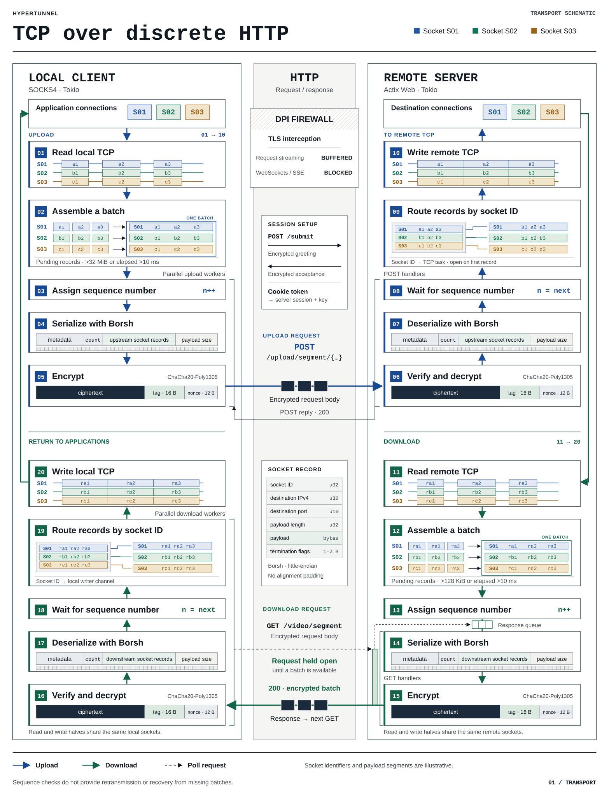

# Hypertunnel

This is a firewall evasion system proof-of-concept + A Level Computer Science research project ([report](./hypertunnel-a-level-project-report.pdf)) that I built while I was at school. The majority of report is an in-depth review and chronology of firewall circumvention and censorship technology, focused on the Great Firewall of China.

Hypertunnel is intended to target a specific type of highly restrictive corporate firewall that blocks all non-HTTPS traffic, and decrypts HTTPS traffic with a mandatory certificate to inspect its contents. The specific one my school used (Sophos XG) also banned Websockets and buffered requests, preventing request-streaming approaches. This software was designed for that use case. It was developed and tested with permission from the school. The initial built-in-a-weekend proof of concept is [here](https://github.com/Alex-Programs/http-proxy-dpi-evasion), while an unrelated open-source login system for Sophos XG is [here](https://github.com/Alex-Programs/openxgauthenticator).

It exposes a SOCKS4 proxy that tunnels data over *discrete HTTP requests*, bundling data together into requests that look like a simple file upload or Twitch stream. While this system is relatively easy to fingerprint, it need not be; creating a particularly plausible fake protocol wasn't part of the design spec. In order to circumvent the restriction on server-sent-requests, the server holds requests open until it has data to return.

The system was originally built in 2023-2024 <b>without AI assistance</b>, with the most recent commit updating the readme and having GPT-6 Astra create the diagram of how the system works.

Do not use this system in practice. It is not designed for real-world use.